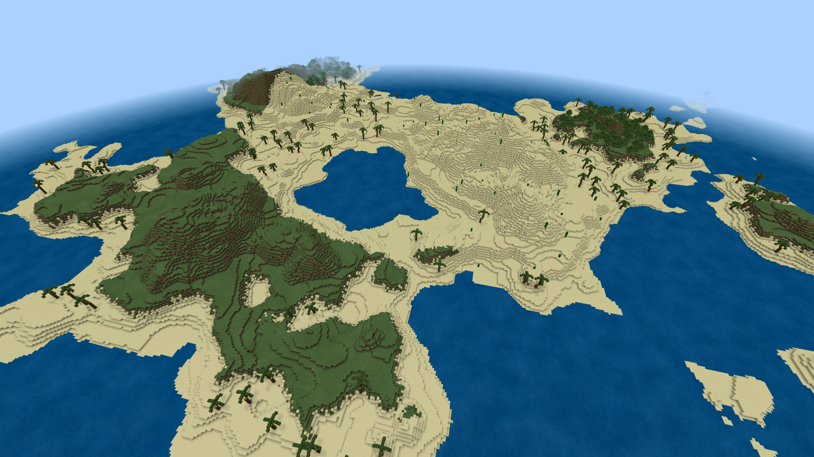

# PocketIslands

A generator for ***PocketMine-MP*** that generates oceans with islands.

## How to
This plugin can't manage worlds, so you'll need another plugin to create the world.
Set the generator to *islands*. the rest is optional. Alternatively you can use pocketmine's own world manager in pocketmine.yml

The old style generator has is still available as **islandslegacy**, but will no longer be improved.

**[!] Multiworld has been tested and is not compatible with this plugin**

## Features
 
 [✔] Custom generator
 
 [✔] Generate seperate islands
 
 [✔] (Semi-) realistic islands
 
 [✔] Better terrain
 
 [✔] Custom and better biomes
 
 [✔] Better mountains (real mountains only exist in the legacy generator, because normal islands are not big enough)
 
 [✔] Palm trees and cactusses
 
## Creator
*PocketIslands* was created by **AndreasHGK**
I believe in free plugins available to everyone.